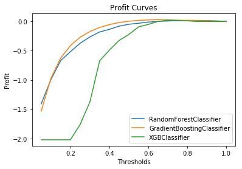

# Success of Email Marketing Campaigns

# Motivation

SME (Small to Medium Businesses) are often trying to make use of Email campaigns to target their prospective customers and to promote/advertise their products to these customers. While advertising campaigns can help to promote the product, it is always essential to understand and quantify the precise relationship between advertising cost and profits. Thus, the business will know how much to invest into these campaigns. 

# Data

68,000 rows >> separated into training (80%) and test (20%)  sets
11 features
  - 1 identifier column (email ID)
  - 5 categorical : Type of Email, Type of Campaign, Email Source Type, Customer Location, Time Email Sent Category
  - 5 numerical: Email Word Count, Total links, Total Images, Total Past Communications, Subject Hotness Score

Each email was originally categorized into: Ignored, Read, Acknowledged
For the purpose of analyzing the success of email advertising, we are treating read and acknowledged as one group. Because as long as the customer reads/acknowledged the email, the purpose of this advertising campaign has been served. 

# EDA

Dataset was highly imbalanced even after combinging Read & Acknowledged. 

Interested to see if word count or number of past communications differs between the two groups. 

# Setting Up the Business Metric

Assumptions:
  - cost for each email sent: $3
  - value gained if customer reads email: $8
  - no email sent if customer predicted to ignore email 
  
 Cost benefit matrix:
 
 

# Model Selection

According to the cost benefit matrix, we would want to minimize false positive, which means we need to maximize the precision value. 

Due to imbalanced data, both undersampling and oversampling were conducted to produce the precision score.  

 

The top performing models were XGBoost Classifier -and- GradientBoosting Classifier. Both yield a precision score of 0.80.

To further decide on the best performing model, let's plot a profit curve to check which model yields a higher profit. 

 

Looking at feature importance, we can see that the top three influential features are:
  - word count
  - total number of past communications
  - total links
  

# Conclusion

The Gradient Boosting Classifer with a threshold of 0.4 yielded the highest profit of $0.21 per email. 
One thing to note is that the model was trained on oversampled training set with 1:1 (majority : minority) ratio. 

# Future Work

Could try and not combining read+acknowledged classes and predict them separately. This may be useful in the case where the company is interested in the Click-Thru-Rate of their advertising emails, assuming acknowledged class means the customer clicked on a link. 
